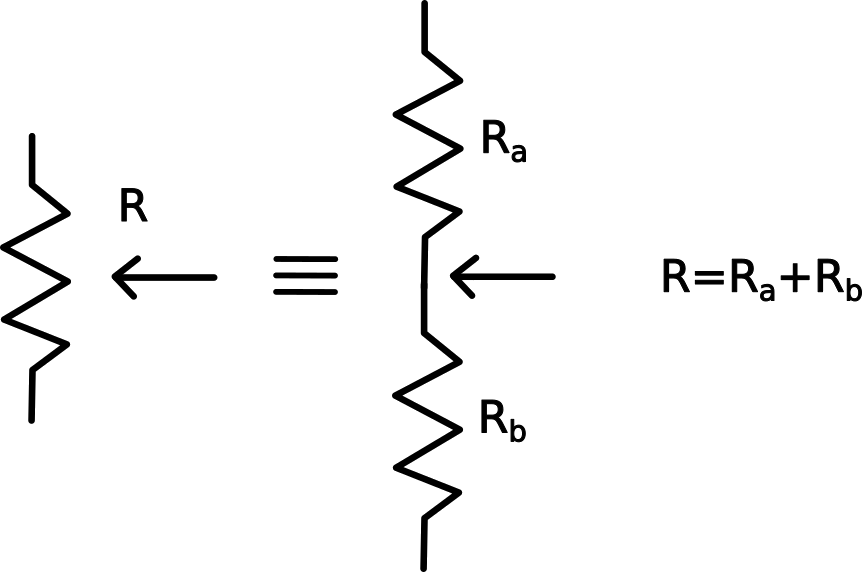
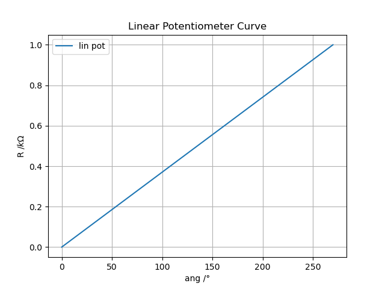
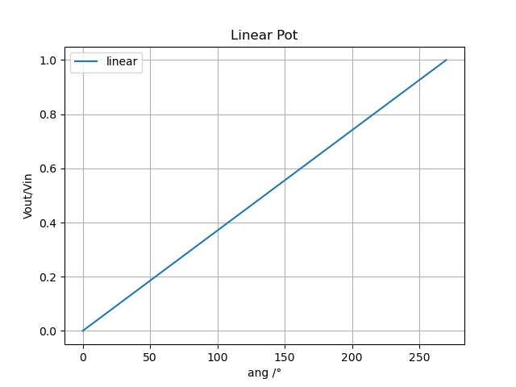
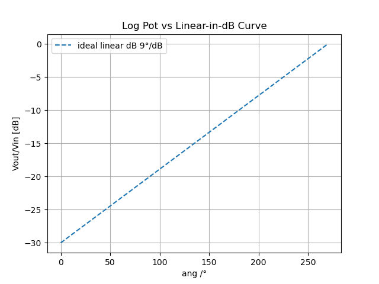
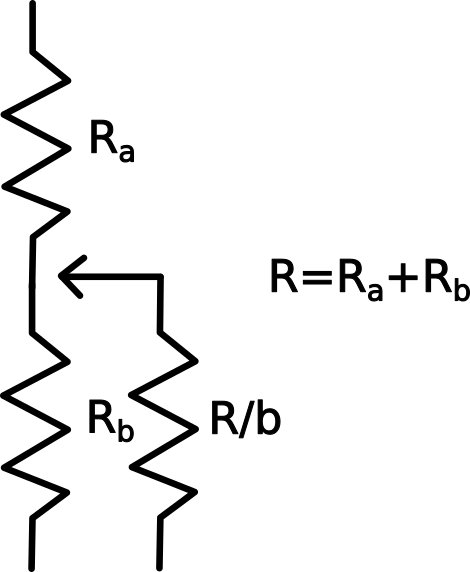
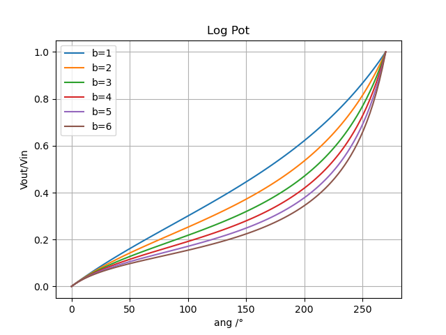
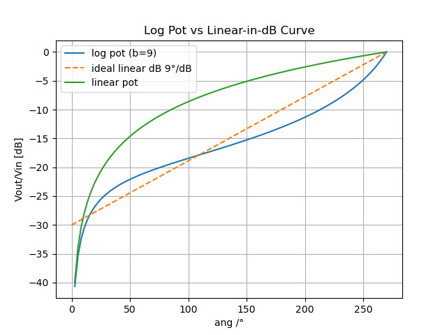

# What’s in my POT?

You probably have some potentiometers lying around, but have you ever wondered about the different types of POTs available on the market?
Each potentiometer has its own working principle and specific applications. Instead of procrastinating, defining a simulation strategy in advance can help you better understand how potentiometers behave (especially if you're not already familiar with them).\
To visualize how they work, take a look at the figure below:\

A potentiometer is essentially a voltage divider, where: $V_{out}=V_{in}\frac{R_b}{R_b+R_a}$. If the angle change $R_a$ will be reduced and $R_b$ increased and viceversa. The sum of  $R_a$ and  $R_b$ is $R$, the value of the POT. This linear relationship defines what we call a linear potentiometer.\
Most commercial potentiometers are linear. As shown in the figure below, a bit of math confirms that there's a direct proportionality between the rotation angle and the resistance value.\

Note that the maximum rotation angle isn’t always 360°, it varies by manufacturer. The corresponding voltage division output is shown in the next figure.\

## Logarithmic Potentiometers

Logarithmic potentiometers share the same basic structure as linear ones, but the relationship between the knob angle and resistance is different. While the electrical principle (voltage division) stays the same, the resistance varies logarithmically with the angle.\
This is especially useful in audio applications, where our ears perceive loudness logarithmically. The image below shows how the behavior differs from a linear POT.\

BUT... despite their clear advantages in audio circuits, true logarithmic potentiometers are relatively uncommon and harder to find.

### How to 'create' a Logarithmic Potentiometers

A creative solution to implement a log POT is to use a resistance in parallel to the output. Supposing that the sum of $R_a$ and  $R_b$ is $R$ and the resistance in parallel is multiplied with the factor 1/b.\

By changing the value of b, you can generate different response curves:\

Fixing b=9, the figure below compares the response of:
- The ideal logarithmic potentiometer (orange dashed line)
- A standard linear potentiometer (green line)
- A linear POT modified with the parallel resistor (blue line)\

